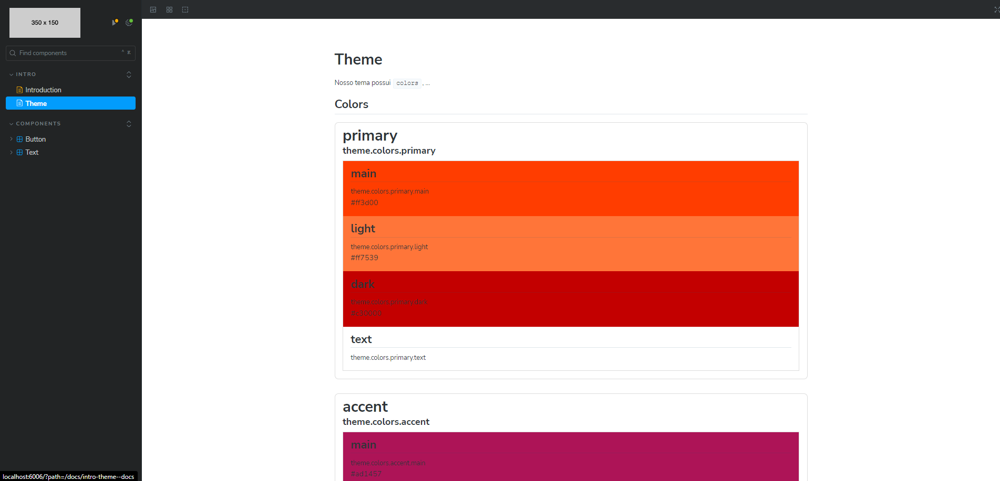
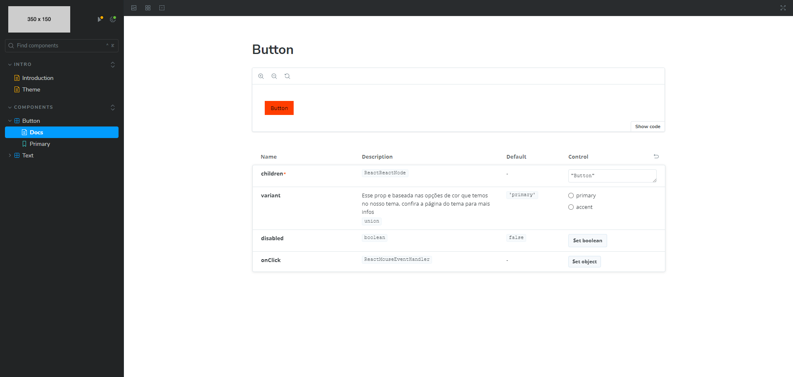
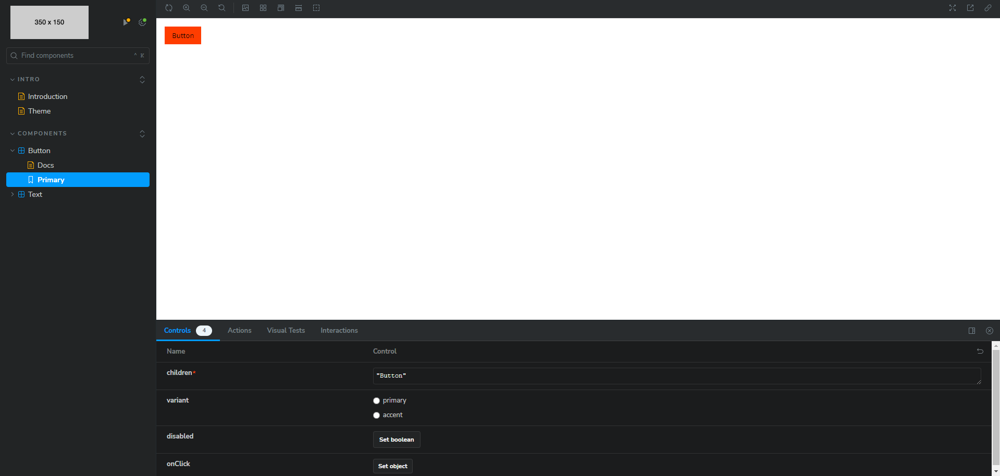

# Projeto Nextjs-StoryBook

Projeto desenvolvido durante o curso de NextJs: documentando seu Front-End com o Storybook

# Principais tecnologias utilizadas no projeto
* Next
* TypeScript
* NodeJS
* Storybook
* Styled-Components

# Imagens do projeto

Pagina do Storybook com os temas do projeto

Pagina de documentação do componente

Pagina de funcionalidades do componente
